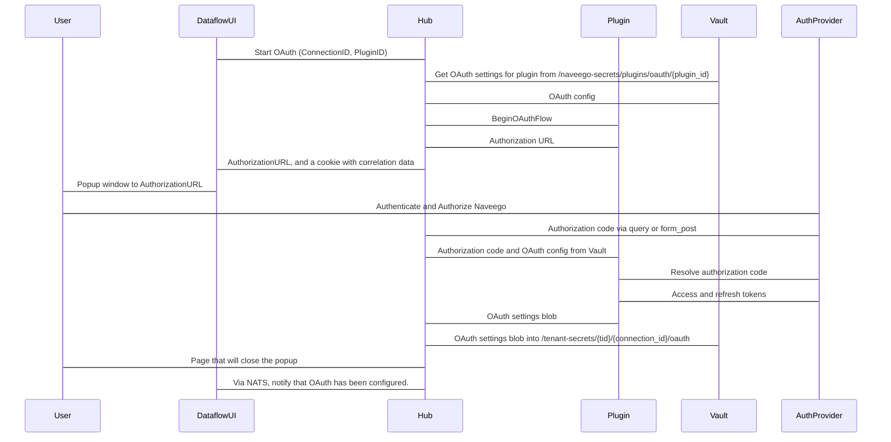

```mermaid
sequenceDiagram
    participant User
    participant DataflowUI
    participant Hub
    participant Plugin
    participant Vault
    participant AuthProvider
    DataflowUI->Hub: Start OAuth (ConnectionID, PluginID)
    Hub->Vault: Get OAuth settings for plugin from /naveego-secrets/plugins/oauth/{plugin_id}
    Vault->Hub: OAuth config
    Hub->Plugin: BeginOAuthFlow
    Plugin->Hub: Authorization URL
    Hub->DataflowUI: AuthorizationURL, and a cookie with correlation data
    DataflowUI->User: Popup window to AuthorizationURL
    User->AuthProvider: Authenticate and Authorize Naveego
    AuthProvider->Hub: Authorization code via query or form_post
    Hub->Plugin: Authorization code and OAuth config from Vault
    Plugin->AuthProvider: Resolve authorization code
    AuthProvider->Plugin: Access and refresh tokens
    Plugin->Hub: OAuth settings blob
    Hub->Vault: OAuth settings blob into /tenant-secrets/{tid}/{connection_id}/oauth
    Hub->User: Page that will close the popup
    Hub->DataflowUI: Via NATS, notify that OAuth has been configured.


```
